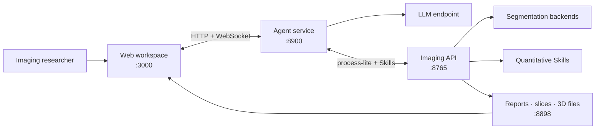

<div align="center">

**English** | [简体中文](README.zh-CN.md)


# VoxelSage

### CT analysis without stitching together segmentation, agents, and 3D tools

Self-hosted medical-imaging workspace for abdominal CT research. Upload DICOM
or NIfTI data, ask questions in natural language, and move from segmentation
to measurements, key slices, and interactive 3D review in one place.

[](https://github.com/ZJUMAI/VoxelSage)
[](https://github.com/ZJUMAI/VoxelSage/commits/main)
[](LICENSE)


[Quick Start](#quick-start) · [What You Can Do](#what-you-can-do) · [How It Works](#how-it-works) · [Skills API](#skills-api--ai-agent-integration) · [Documentation](#documentation)

</div>

<p align="center">
  <a href="docs/assets/web_overview.png">
    
  </a>
</p>

<p align="center"><em>One case, one conversation, and the imaging evidence beside it.</em></p>

> [!CAUTION]
> VoxelSage is experimental research software—not a medical device. Do not use
> it for clinical diagnosis, treatment decisions, or any other clinical purpose.

## Quick Start

### Prerequisites

- Python 3.10+
- Node.js 20+ and npm
- An OpenAI-compatible LLM endpoint
- Enough CPU, memory, and disk space for the selected segmentation backend;
  some backends also require a compatible CUDA GPU

### Install

```bash
git clone https://github.com/ZJUMAI/VoxelSage.git && cd VoxelSage
python -m venv .venv && source .venv/bin/activate
pip install -r Port_B/requirements.txt -r Port_A/requirements.txt
npm --prefix Frontend ci
cp Frontend/.env.example Frontend/.env.local
```

Configure the LLM endpoint in the same shell used to start Port A:

```bash
export DASHSCOPE_API_KEY="your-api-key"
export DASHSCOPE_BASE_URL="https://your-llm-endpoint.example.com/v1"
```

### Run

Open four terminals from the repository root:

<details open>
<summary><strong>1 · Imaging API</strong> — segmentation and analysis on <code>:8765</code></summary>

```bash
cd Port_B
../.venv/bin/python API.py server --port 8765
```

</details>

<details open>
<summary><strong>2 · Output proxy</strong> — generated files on <code>:8898</code></summary>

```bash
cd Port_B
../.venv/bin/python file_proxy.py --port 8898
```

</details>

<details open>
<summary><strong>3 · Agent service</strong> — LLM orchestration on <code>:8900</code></summary>

```bash
cd Port_A
../.venv/bin/python -m core.server
```

</details>

<details open>
<summary><strong>4 · Web app</strong> — research workspace on <code>:3000</code></summary>

```bash
npm --prefix Frontend run dev
```

</details>

Open **<http://localhost:3000>**. The first TotalSegmentator run may download
model assets. Optional VISTA3D support requires a separate upstream checkout,
configuration, and model assets; see the
[Port B guide](Port_B/README.md#segmentation-backends).

## What You Can Do

- **Keep the case in one workspace** — upload NIfTI or DICOM data, organize
  cases, inspect axial slices, and open generated 3D results without switching
  applications.
- **Ask questions instead of wiring pipelines** — the agent selects relevant
  imaging Skills and streams progress and results back to the browser.
- **Turn masks into evidence** — measure tumor diameter, tumor-to-vessel
  distance, vessel volume, and liver-related quantities through reusable Skills.
- **Review results spatially** — connect key slices, segmentation overlays, and
  interactive Three.js reconstructions to the same analysis session.
- **Avoid repeating expensive work** — reuse case outputs, filter redundant
  tool calls, validate measurements, and apply recovery strategies after errors.
- **Extend the analysis layer** — register additional Skills behind a common,
  function-calling-compatible interface.
- **Compare constrained planning strategies** — keep deterministic 3D surface
  baselines as the default, explicitly opt into the frozen learned ranker plus
  simulator shield, and reproduce its 2D evidence under
  `Research/planar-resection-planning`.

## How It Works



```text
DICOM / NIfTI → segmentation → post-processing → quantitative Skills
               → structured results → 2D / 3D review → agent response
```

| Service | Responsibility | Default endpoint |
| --- | --- | --- |
| **Frontend** | Case management, chat, 2D slices, and 3D result display | `http://localhost:3000` |
| **Port A** | LLM loop, tool selection, validation, recovery, and streaming | `http://localhost:8900` |
| **Port B** | Segmentation, measurements, structured output, and Skills | `http://localhost:8765` |
| **Output proxy** | Browser-accessible generated files | `http://localhost:8898` |

## Skills API & AI Agent Integration

Port B exposes its analysis routines as function-calling-compatible tools. An
external agent can discover available Skills at runtime and invoke only the
analysis needed for a case:

1. `POST /api/process-lite` — prepare, segment, and post-process a case.
2. `GET /api/skills/list` — return registered Skills as tool definitions.
3. `POST /api/skills/run` — execute one Skill against the returned `case_id`.

With Port B running, inspect the live tool catalog:

```bash
curl http://localhost:8765/api/skills/list
```

Built-in Skills include liver analysis, key-slice selection, 3D reconstruction,
tumor diameter, tumor-to-vessel distance, vessel volume, and segmentation
modification. Port A already implements the iterative LLM-to-Skills loop for
the web application.

## Configuration

| Variable | Service | Purpose | Default |
| --- | --- | --- | --- |
| `DASHSCOPE_API_KEY` | Port A | LLM API credential | Required |
| `DASHSCOPE_BASE_URL` | Port A | OpenAI-compatible API base URL | Required |
| `PORT_B_INTERNAL` | Port A | Internal Port B address | `http://localhost:8765` |
| `PUBLIC_BASE_URL` | Port B | Public output-proxy base URL | `http://127.0.0.1:8898` |
| `VOXELSAGE_OUTPUT_DIR` | Port B | Runtime output directory | `Port_B/output` |
| `VISTA3D_ROOT` | Port B | Optional upstream VISTA3D source directory | Unset |
| `VOXELSAGE_RESECTION_MODEL_CHECKPOINT` | Port B | Authorized frozen v10.6 planning checkpoint | Unset |

See [`Frontend/.env.example`](Frontend/.env.example) for browser-facing service
URLs and [`Port_B/.env.example`](Port_B/.env.example) for optional imaging
runtime settings.

## Repository Layout

```text
VoxelSage/
├── Frontend/                    # React 19 + TypeScript + Vite workspace
├── Port_A/                      # LLM agent and WebSocket orchestration
│   ├── core/                    # Agent loop, validation, and recovery
│   ├── docs/                    # Architecture notes
│   └── tests/
├── Port_B/                      # Imaging API and analysis runtime
│   ├── SegAgent/                # Segmentation backend adapters
│   ├── Structural_Report/       # Structured analysis output
│   ├── Tool_Box/                # Imaging and measurement utilities
│   ├── Visualization/           # Slice and Three.js output generation
│   ├── skills/                  # Built-in and user-registered Skills
│   └── tests/
├── Research/
│   └── planar-resection-planning/ # 2D planning and learning simulator
├── LICENSE
├── NOTICE
└── THIRD_PARTY_NOTICES.md
```

## Verification

```bash
cd Port_B && ../.venv/bin/python -m pytest -q
cd ../Port_A && ../.venv/bin/python tests/test_p0_optimizations.py
cd ../Frontend && npm run lint && npm run build
```

## Documentation

- [Port A guide](Port_A/README.md) — agent setup and core modules
- [Port A architecture](Port_A/docs/ARCHITECTURE.md) — agent loop, tool
  optimization, reflection, and frontend protocol
- [Port B guide](Port_B/README.md) — imaging service, model backends, and data
  handling
- [Frontend guide](Frontend/README.md) — UI features, configuration, and build
- [Learned, shielded 3D sequence Skill](docs/LEARNED_RESECTION_SEQUENCE.md)
  — opt-in setup, frozen-hash check, failure behavior, and scope limits
- [Planar resection planning research](Research/planar-resection-planning/README.md)
  — simulator, BC/PPO experiments, exact shield, and confirmatory results
- [Third-party notices](THIRD_PARTY_NOTICES.md) — dependencies and provenance

## Contributing & Support

Pull requests are welcome. Before opening one, run the checks in
[Verification](#verification) and make sure no patient data, credentials, model
weights, or generated medical artifacts are included.

- **Bug reports:** [GitHub Issues](https://github.com/ZJUMAI/VoxelSage/issues)
- **Research questions and feature ideas:** use GitHub Issues until Discussions
  is enabled
- **Private security reports:** [binghong.25@intl.zju.edu.cn](mailto:binghong.25@intl.zju.edu.cn)

## Responsible Use

- Process only data you are authorized to use, and remove DICOM identifiers and
  other protected health information before sharing any artifact.
- Patient data, model weights, generated outputs, and common medical-image
  formats are intentionally excluded from version control.
- External models, datasets, and dependencies retain their original licences.
- Treat every segmentation, measurement, report, and agent response as an
  experimental result that requires qualified human review.

## License & Acknowledgments

Code authored for VoxelSage is available under the
[Apache License 2.0](LICENSE). External software, model weights, and datasets
are not relicensed by this project; see [`NOTICE`](NOTICE) and
[`THIRD_PARTY_NOTICES.md`](THIRD_PARTY_NOTICES.md).

Port B was informed by the 3DMedAgent project and published work on
Bézier-surface liver-resection planning. VoxelSage is not affiliated with or
endorsed by those upstream authors.
