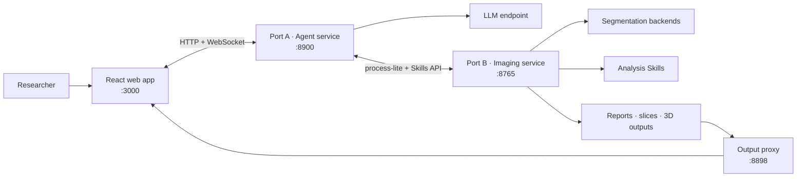

<div align="center">

**English** | [简体中文](README.zh-CN.md)

# VoxelSage

### An agentic workspace for 3D medical-imaging research

Upload abdominal CT data, explore 2D and 3D results, and let an LLM agent
orchestrate segmentation and quantitative analysis Skills through one web
interface.

[](LICENSE)


[Features](#features) · [Architecture](#architecture) · [Quick start](#quick-start) · [Documentation](#documentation) · [License](#license)

</div>

<p align="center">
  <a href="docs/assets/web_overview.png">
    
  </a>
</p>

<p align="center"><em>From conversational analysis to interactive 3D reconstruction in one workspace.</em></p>

> [!CAUTION]
> VoxelSage is experimental research software—not a medical device. Do not use
> it for clinical diagnosis, treatment decisions, or any other clinical purpose.

## Overview

VoxelSage brings the imaging pipeline and the conversational interface into a
single research workspace. Its three services separate user interaction, agent
orchestration, and compute-intensive imaging operations, so each layer can be
developed and deployed independently.

| Component | Role | Default endpoint |
| --- | --- | --- |
| **Web app** | Case management, chat, 2D slice review, and 3D result display | `http://localhost:3000` |
| **Port A · Agent** | LLM loop, tool selection, result validation, reflection, and streaming | `http://localhost:8900` |
| **Port B · Imaging** | Segmentation, measurements, structured results, and built-in Skills | `http://localhost:8765` |
| **Output proxy** | Browser-accessible generated files | `http://localhost:8898` |

## Features

- **Medical-image workspace** — upload NIfTI or DICOM data, organize cases,
  browse axial slices, and inspect voxel values.
- **Agent-guided analysis** — ask questions in natural language while the agent
  selects and runs the relevant imaging Skills.
- **Segmentation orchestration** — use TotalSegmentator by default, with
  optional VISTA3D integration for separately licensed installations.
- **Quantitative Skills** — run liver analysis, tumor-diameter measurement,
  tumor-to-vessel distance, vessel-volume analysis, and key-slice selection.
- **Interactive visualization** — inspect segmentation outputs through the 2D
  viewer and generated Three.js reconstructions.
- **Resilient execution** — reuse case results, filter redundant tool calls,
  validate measurements, and apply recovery strategies when a Skill fails.
- **Extensible Skill layer** — expose analysis routines through a common
  function-calling-compatible interface.

## Architecture



The core workflow is:

```text
DICOM / NIfTI → segmentation → post-processing → quantitative Skills
               → structured results → 2D / 3D visualization → agent response
```

## Quick start

### Prerequisites

- Python 3.10+
- Node.js 20+ and npm
- An OpenAI-compatible LLM endpoint
- Enough CPU, memory, disk space, and—when required by the selected
  segmentation backend—a compatible CUDA GPU

### 1. Install dependencies

From the repository root:

```bash
python -m venv .venv
source .venv/bin/activate

pip install -r Port_B/requirements.txt
pip install -r Port_A/requirements.txt

cd Frontend/voxelsage-public
npm ci
cp .env.example .env.local
cd ../..
```

### 2. Configure the agent

Export the credentials and base URL for your LLM endpoint. Never commit real
credentials to the repository.

```bash
export DASHSCOPE_API_KEY="your-api-key"
export DASHSCOPE_BASE_URL="https://your-llm-endpoint.example.com/v1"
```

Port A connects to Port B at `http://localhost:8765` by default. For a custom
deployment, also set `PORT_B_INTERNAL` and the frontend URLs described in
[`Frontend/voxelsage-public/.env.example`](Frontend/voxelsage-public/.env.example).

### 3. Start the services

Open four terminals at the repository root.

<details open>
<summary><strong>Terminal 1 · Port B imaging API</strong></summary>

```bash
cd Port_B
../.venv/bin/python API.py server --port 8765
```

</details>

<details open>
<summary><strong>Terminal 2 · Output proxy</strong></summary>

```bash
cd Port_B
../.venv/bin/python file_proxy.py --port 8898
```

</details>

<details open>
<summary><strong>Terminal 3 · Port A agent service</strong></summary>

```bash
cd Port_A
../.venv/bin/python -m core.server
```

</details>

<details open>
<summary><strong>Terminal 4 · Web app</strong></summary>

```bash
cd Frontend/voxelsage-public
npm run dev
```

</details>

Then open **<http://localhost:3000>**.

> [!NOTE]
> The first TotalSegmentator run may download model assets. VISTA3D is optional
> and requires a separate upstream checkout, configuration, and model assets;
> see the [Port B guide](Port_B/README.md#segmentation-backends).

## Configuration

| Variable | Service | Purpose | Default |
| --- | --- | --- | --- |
| `DASHSCOPE_API_KEY` | Port A | LLM API credential | Required |
| `DASHSCOPE_BASE_URL` | Port A | OpenAI-compatible API base URL | Required |
| `PORT_B_INTERNAL` | Port A | Internal Port B address | `http://localhost:8765` |
| `PUBLIC_BASE_URL` | Port B | Public output-proxy base URL | `http://127.0.0.1:8898` |
| `VOXELSAGE_OUTPUT_DIR` | Port B | Runtime output directory | `Port_B/output` |
| `VISTA3D_ROOT` | Port B | Optional upstream VISTA3D source directory | Unset |

For HTTPS or remote deployments, set all three `VITE_*` values in
`Frontend/voxelsage-public/.env.local` before building. Use `https://` and
`wss://` endpoints, or route the services through a same-origin reverse proxy.

## Repository layout

```text
VoxelSage/
├── Frontend/voxelsage-public/   # React 19 + TypeScript + Vite web app
├── Port_A/                      # LLM agent and WebSocket orchestration
│   ├── core/                    # Agent loop, validation, and recovery
│   ├── docs/                    # Port A architecture notes
│   └── tests/
├── Port_B/                      # Imaging API and analysis runtime
│   ├── SegAgent/                # Segmentation backend adapters
│   ├── Structural_Report/       # Structured analysis output
│   ├── Tool_Box/                # Imaging and measurement utilities
│   ├── Visualization/           # Slice and Three.js output generation
│   ├── skills/                  # Built-in and user-registered Skills
│   └── tests/
├── LICENSE
├── NOTICE
└── THIRD_PARTY_NOTICES.md
```

## Verification

Run the backend tests and check the production frontend build:

```bash
cd Port_B
../.venv/bin/python -m pytest -q

cd ../Port_A
../.venv/bin/python tests/test_p0_optimizations.py

cd ../Frontend/voxelsage-public
npm run lint
npm run build
```

## Documentation

- [Port A guide](Port_A/README.md) — agent setup and core modules
- [Port A architecture](Port_A/docs/ARCHITECTURE.md) — agent loop, tool
  optimization, reflection, and frontend protocol
- [Port B guide](Port_B/README.md) — imaging service, model backends, and data
  handling
- [Frontend guide](Frontend/README.md) — UI features, configuration, and build
- [Third-party notices](THIRD_PARTY_NOTICES.md) — dependency and provenance
  information

## Data, models, and responsible use

- Use only data you are authorized to process, and remove DICOM identifiers and
  other protected health information before sharing any artifact.
- Patient data, model weights, generated outputs, and common medical-image
  formats are intentionally excluded from version control.
- Model weights and datasets are not distributed with this repository. Each
  external model, dataset, and dependency remains subject to its own licence.
- Treat every segmentation, measurement, report, and agent response as an
  experimental result that requires qualified human review.

## License

Code authored for VoxelSage is available under the
[Apache License 2.0](LICENSE). External software, model weights, and datasets
retain their original licences and are not relicensed by this project. See
[`NOTICE`](NOTICE) and [`THIRD_PARTY_NOTICES.md`](THIRD_PARTY_NOTICES.md) for
details.

## Acknowledgments

Port B was informed by the 3DMedAgent project and published work on
Bézier-surface liver-resection planning. VoxelSage is not affiliated with or
endorsed by those upstream authors; detailed attribution is maintained in
[THIRD_PARTY_NOTICES.md](THIRD_PARTY_NOTICES.md).
