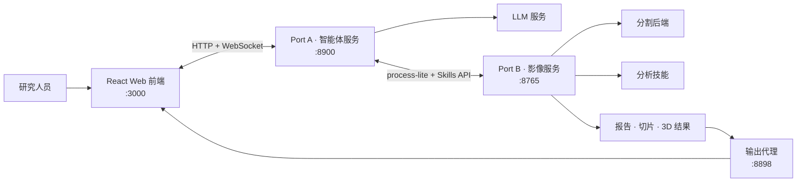

<div align="center">

[English](README.md) | **简体中文**

# VoxelSage

### 面向 3D 医学影像研究的智能体工作台

上传腹部 CT 数据，在统一的 Web 界面中查看 2D/3D 结果，并由 LLM
智能体编排分割与定量分析技能。

[](LICENSE)


[功能特性](#功能特性) · [系统架构](#系统架构) · [快速开始](#快速开始) · [项目文档](#项目文档) · [开源许可](#开源许可)

</div>

<p align="center">
  <a href="docs/assets/web_overview.png">
    
  </a>
</p>

<p align="center"><em>在统一工作台中完成对话式分析与交互式三维重建。</em></p>

> [!CAUTION]
> VoxelSage 是实验性科研软件，并非医疗器械。请勿将其用于临床诊断、
> 治疗决策或任何其他临床用途。

## 项目简介

VoxelSage 将医学影像流水线与对话式交互整合到一个科研工作台中。系统通过
三个独立服务分离用户交互、智能体编排和计算密集型影像处理，便于各层独立
开发与部署。

| 组件 | 职责 | 默认地址 |
| --- | --- | --- |
| **Web 前端** | 病例管理、对话、2D 切片浏览和 3D 结果展示 | `http://localhost:3000` |
| **Port A · 智能体** | LLM 循环、工具选择、结果校验、反思恢复和流式输出 | `http://localhost:8900` |
| **Port B · 影像服务** | 分割、测量、结构化结果和内置技能 | `http://localhost:8765` |
| **输出代理** | 向浏览器提供生成的结果文件 | `http://localhost:8898` |

## 功能特性

- **医学影像工作台** — 上传 NIfTI 或 DICOM 数据，管理病例、浏览轴位切片并
  查看体素值。
- **智能体辅助分析** — 使用自然语言提问，由智能体选择并运行相关影像技能。
- **分割任务编排** — 默认支持 TotalSegmentator，也可接入单独授权和安装的
  VISTA3D。
- **定量分析技能** — 支持肝脏综合分析、肿瘤直径测量、肿瘤—血管距离、
  血管体积分析和关键切片选取。
- **交互式可视化** — 通过 2D 查看器和生成的 Three.js 重建检查分割结果。
- **稳健执行机制** — 复用病例结果、过滤冗余工具调用、校验测量值，并在技能
  失败时执行恢复策略。
- **可扩展技能层** — 通过统一、兼容函数调用的接口开放新的分析流程。

## 系统架构



核心流程如下：

```text
DICOM / NIfTI → 分割 → 后处理 → 定量分析技能
               → 结构化结果 → 2D / 3D 可视化 → 智能体回答
```

## 快速开始

### 环境要求

- Python 3.10+
- Node.js 20+ 和 npm
- 兼容 OpenAI API 的 LLM 服务
- 满足所选分割后端要求的 CPU、内存、磁盘空间，以及必要时的 CUDA GPU

### 1. 安装依赖

在仓库根目录执行：

```bash
python -m venv .venv
source .venv/bin/activate

pip install -r Port_B/requirements.txt
pip install -r Port_A/requirements.txt

cd Frontend
npm ci
cp .env.example .env.local
cd ..
```

### 2. 配置智能体

导出 LLM 服务的凭据和基础地址。请勿将真实凭据提交到仓库。

```bash
export DASHSCOPE_API_KEY="your-api-key"
export DASHSCOPE_BASE_URL="https://your-llm-endpoint.example.com/v1"
```

Port A 默认连接 `http://localhost:8765` 上的 Port B。自定义部署时，还需设置
`PORT_B_INTERNAL` 以及
[`Frontend/.env.example`](Frontend/.env.example)
中说明的前端地址。

### 3. 启动服务

在仓库根目录打开四个终端。

<details open>
<summary><strong>终端 1 · Port B 影像 API</strong></summary>

```bash
cd Port_B
../.venv/bin/python API.py server --port 8765
```

</details>

<details open>
<summary><strong>终端 2 · 输出代理</strong></summary>

```bash
cd Port_B
../.venv/bin/python file_proxy.py --port 8898
```

</details>

<details open>
<summary><strong>终端 3 · Port A 智能体服务</strong></summary>

```bash
cd Port_A
../.venv/bin/python -m core.server
```

</details>

<details open>
<summary><strong>终端 4 · Web 前端</strong></summary>

```bash
cd Frontend
npm run dev
```

</details>

启动完成后访问 **<http://localhost:3000>**。

> [!NOTE]
> 首次运行 TotalSegmentator 时可能会下载模型文件。VISTA3D 为可选后端，
> 需要单独准备上游源码、配置和模型文件；详见
> [Port B 文档](Port_B/README.md#segmentation-backends)。

## 配置说明

| 变量 | 服务 | 用途 | 默认值 |
| --- | --- | --- | --- |
| `DASHSCOPE_API_KEY` | Port A | LLM API 凭据 | 必填 |
| `DASHSCOPE_BASE_URL` | Port A | 兼容 OpenAI API 的基础地址 | 必填 |
| `PORT_B_INTERNAL` | Port A | Port B 内部访问地址 | `http://localhost:8765` |
| `PUBLIC_BASE_URL` | Port B | 输出代理的公开基础地址 | `http://127.0.0.1:8898` |
| `VOXELSAGE_OUTPUT_DIR` | Port B | 运行时输出目录 | `Port_B/output` |
| `VISTA3D_ROOT` | Port B | 可选的 VISTA3D 上游源码目录 | 未设置 |

使用 HTTPS 或远程部署时，请在构建前设置
`Frontend/.env.local` 中的三个 `VITE_*` 变量，并使用
`https://`、`wss://` 地址，或通过同源反向代理转发服务。

## 仓库结构

```text
VoxelSage/
├── Frontend/                    # React 19 + TypeScript + Vite 前端
├── Port_A/                      # LLM 智能体与 WebSocket 编排
│   ├── core/                    # 智能体循环、校验和恢复机制
│   ├── docs/                    # Port A 架构文档
│   └── tests/
├── Port_B/                      # 影像 API 与分析运行时
│   ├── SegAgent/                # 分割后端适配器
│   ├── Structural_Report/       # 结构化分析结果
│   ├── Tool_Box/                # 影像处理和测量工具
│   ├── Visualization/           # 切片与 Three.js 结果生成
│   ├── skills/                  # 内置及用户注册技能
│   └── tests/
├── LICENSE
├── NOTICE
└── THIRD_PARTY_NOTICES.md
```

## 验证

运行后端测试，并检查前端生产构建：

```bash
cd Port_B
../.venv/bin/python -m pytest -q

cd ../Port_A
../.venv/bin/python tests/test_p0_optimizations.py

cd ../Frontend
npm run lint
npm run build
```

## 项目文档

- [Port A 使用说明](Port_A/README.md) — 智能体配置与核心模块
- [Port A 架构](Port_A/docs/ARCHITECTURE.md) — 智能体循环、工具优化、反思机制
  和前端协议
- [Port B 使用说明](Port_B/README.md) — 影像服务、模型后端和数据处理
- [前端使用说明](Frontend/README.md) — UI 功能、配置和构建
- [第三方声明](THIRD_PARTY_NOTICES.md) — 依赖与来源信息

## 数据、模型与负责任使用

- 仅处理已获得授权的数据；分享任何产物前，请移除 DICOM 标识符及其他受保护
  的健康信息。
- 患者数据、模型权重、生成结果和常见医学影像格式均有意排除在版本控制之外。
- 本仓库不分发模型权重和数据集；外部模型、数据集与依赖继续适用其原始许可。
- 所有分割、测量、报告和智能体回答均为实验结果，必须由具备资质的人员复核。

## 开源许可

VoxelSage 原创代码采用 [Apache License 2.0](LICENSE) 许可。外部软件、模型
权重和数据集保留其原始许可，不因本项目而重新授权。详情请参阅
[`NOTICE`](NOTICE) 和
[`THIRD_PARTY_NOTICES.md`](THIRD_PARTY_NOTICES.md)。

## 致谢

Port B 的设计受到 3DMedAgent 项目及 Bézier 曲面肝切除规划相关公开工作的
启发。VoxelSage 与相关上游作者不存在隶属或背书关系；详细来源说明见
[THIRD_PARTY_NOTICES.md](THIRD_PARTY_NOTICES.md)。
