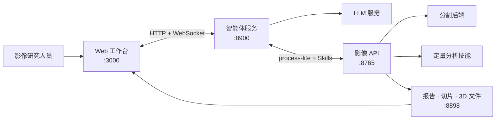

<div align="center">

<p align="center">
  <a href="docs/assets/web_overview.png">
    
  </a>
</p>

<p align="center"><em>同一病例、同一段对话，影像证据始终就在旁边。</em></p>

</div>

> [!CAUTION]
> VoxelSage 是实验性科研软件，并非医疗器械。请勿将其用于临床诊断、
> 治疗决策或任何其他临床用途。

## 快速开始

### 环境要求

- 无需提前准备特定版本的系统 Python。安装脚本会优先复用 Python 3.10–3.12；
  如果没有可用兼容版本，例如系统中只有 Python 3.14 时，会自动下载兼容的 Python 3.12。
- Node.js 20+ 和 npm
- 兼容 OpenAI API 的 LLM 服务
- 满足所选分割后端要求的 CPU、内存和磁盘空间（10 GB+）；默认 VISTA3D
  后端需要能够被 PyTorch CUDA 识别的 NVIDIA GPU
- **强烈建议使用 Ubuntu**。Windows 用户可以先按照微软的 [WSL 安装指南](https://learn.microsoft.com/zh-cn/windows/wsl/install) 安装 Ubuntu，然后在 Ubuntu 终端中执行以下命令。经过测试，本项目在 Ubuntu 和 WSL Ubuntu 可以正常运行；对于其他环境，我们无法保证兼容性。

### 安装

```bash
git clone https://github.com/ZJUMAI/VoxelSage.git && cd VoxelSage
./scripts/setup.sh
```

安装脚本会创建使用 Python 3.10–3.12 的 `.venv`（需要时通过
[`uv`](https://docs.astral.sh/uv/) 自动下载并管理 Python 3.12）、安装 Python
与前端依赖、将 VISTA 官方仓库克隆到
`third_party/`，并通过交互提示依次收集三项必需的 LLM 配置（API Key 输入时
不会显示在终端中）。默认安装**不会**安装 TotalSegmentator。

即便网络良好，首次安装也可能需要数十分钟。在一次经过测试的 WSL 环境中，
`.venv` 约占 6.7 GB。安装过程需要访问 GitHub、PyPI/npm 与 Hugging Face，
也可以配置合适的镜像站。

之后如需配置或更换 LLM 服务，可重新运行交互式配置脚本：

```bash
./scripts/configure.sh
```

脚本只会更新 `.env` 中的三个 LLM 字段，其他部署配置会保留。例如（以下 Key
已经打码，无法实际使用）：

```dotenv
DASHSCOPE_API_KEY=sk-cc8d****c840
DASHSCOPE_BASE_URL=https://api.deepseek.com
LLM_MODEL_NAME=deepseek-v4-flash-vision-exp
```

### 启动

```bash
./scripts/start.sh
```

这一条命令会同时启动影像 API（`:8765`）、输出代理（`:8898`）、智能体服务
（`:8900`）和 Web 前端（`:3000`）。启动后访问
**[http://localhost:3000](http://localhost:3000)**；按 `Ctrl+C` 即可停止全部服务。日志保存在
`.runtime/logs/`。

VISTA3D 是默认后端，也是上述命令唯一安装的分割模型。首次执行分割时，程序会
从 Hugging Face 自动下载官方权重，后续直接复用本地缓存。

### 分割后端

| 后端                               | 安装方式                                       | 选择方式                                  |
| ---------------------------------- | ---------------------------------------------- | ----------------------------------------- |
| **VISTA3D**（默认）          | `./scripts/setup.sh`                         | `SEGMENTATION_BACKEND=vista3d`          |
| **TotalSegmentator**（可选） | `./scripts/setup.sh --with-totalsegmentator` | `SEGMENTATION_BACKEND=totalsegmentator` |

可以在 `.env` 中设置服务级默认后端，也可以为单次请求覆盖：

```bash
curl -X POST http://localhost:8765/api/process-lite \
  -H 'Content-Type: application/json' \
  -d '{"input":"/absolute/path/to/ct.nii.gz","seg_backend":"totalsegmentator"}'
```

只有已显式安装的后端才能被选择。若同一病例此前由另一个后端生成，系统会分配
新的病例 ID，避免静默混用掩膜。模型路径和 CLI 选项详见
[Port B 文档](Port_B/README.md#segmentation-backends)。

### 诊断本地部署

启动前检查依赖版本以及 NVIDIA/PyTorch CUDA；提供 CT 路径时还会检查 MONAI
使用的 NIfTI 维度、仿射矩阵和体素间距：

```bash
./scripts/doctor.py
./scripts/doctor.py /absolute/path/to/ct.nii.gz
```

如果环境是在加入 VISTA3D 兼容性约束之前创建的，请重新执行
`./scripts/setup.sh` 修复。运行期间也可以通过
`GET /api/diagnostics/runtime` 获取相同的依赖与 CUDA 摘要。

## 核心能力

- **让病例留在一个工作台中** — 上传 NIfTI 或 DICOM 数据，管理病例、浏览
  轴位切片并打开 3D 结果，无需来回切换应用。
- **用提问代替手工拼接流水线** — 智能体选择相关影像技能，并将进度与结果
  实时返回浏览器。
- **将分割掩膜转化为量化证据** — 通过复用技能测量肿瘤直径、肿瘤—血管
  距离、血管体积和肝脏相关指标。
- **在空间上下文中复核结果** — 将关键切片、分割叠加与交互式 Three.js
  重建关联到同一个分析会话。
- **避免重复执行高成本任务** — 复用病例结果、过滤冗余工具调用、校验测量值，
  并在发生错误后应用恢复策略。
- **扩展分析能力** — 通过统一、兼容函数调用的接口注册新的分析技能。
- **比较受约束的规划策略** — 默认使用确定性三维曲面基线，也可显式启用
  冻结学习排序器与模拟器安全盾，并在 `Research/planar-resection-planning`
  复现其二维实验依据。

## 工作原理



```text
DICOM / NIfTI → 分割 → 后处理 → 定量分析技能
               → 结构化结果 → 2D / 3D 复核 → 智能体回答
```

| 服务               | 职责                                     | 默认地址                  |
| ------------------ | ---------------------------------------- | ------------------------- |
| **Frontend** | 病例管理、对话、2D 切片和 3D 结果展示    | `http://localhost:3000` |
| **Port A**   | LLM 循环、工具选择、校验、恢复和流式输出 | `http://localhost:8900` |
| **Port B**   | 分割、测量、结构化结果和影像技能         | `http://localhost:8765` |
| **输出代理** | 向浏览器提供生成的文件                   | `http://localhost:8898` |

## Skills API & AI 智能体接入

Port B 将分析流程暴露为兼容函数调用的工具。外部智能体可以在运行时发现可用
技能，并仅对指定病例调用所需分析：

1. `POST /api/process-lite` — 准备、分割并后处理病例。
2. `GET /api/skills/list` — 以工具定义形式返回已注册技能。
3. `POST /api/skills/run` — 使用返回的 `case_id` 执行一个技能。

启动 Port B 后可查看实时工具目录：

```bash
curl http://localhost:8765/api/skills/list
```

内置技能包括肝脏综合分析、关键切片选取、3D 重建、肿瘤直径、肿瘤—血管
距离、血管体积和分割编辑。Port A 已为 Web 应用实现 LLM 与技能之间的迭代
调用循环。

## 配置说明

| 变量                                     | 服务   | 用途                           | 默认值                                         |
| ---------------------------------------- | ------ | ------------------------------ | ---------------------------------------------- |
| `DASHSCOPE_API_KEY`                    | Port A | LLM API 凭据                   | 必填                                           |
| `DASHSCOPE_BASE_URL`                   | Port A | 兼容 OpenAI API 的基础地址     | 必填                                           |
| `LLM_MODEL_NAME`                       | Port A | 当前 LLM 端点实际提供的模型 ID | 必填                                           |
| `PORT_B_INTERNAL`                      | Port A | Port B 内部访问地址            | `http://localhost:8765`                      |
| `PUBLIC_BASE_URL`                      | Port B | 输出代理的公开基础地址         | `http://127.0.0.1:8898`                      |
| `VOXELSAGE_OUTPUT_DIR`                 | Port B | 运行时输出目录                 | `Port_B/output`                              |
| `SEGMENTATION_BACKEND`                 | Port B | 服务级默认分割后端             | `vista3d`                                    |
| `VISTA3D_ROOT`                         | Port B | VISTA3D 官方源码目录           | `third_party/VISTA/vista3d`                  |
| `VISTA3D_CONFIG`                       | Port B | VISTA3D 推理配置               | `Port_B/SegAgent/VISTA3d/configs/infer.yaml` |
| `VISTA3D_MODEL_DIR`                    | Port B | VISTA3D 权重与推理缓存         | `Port_B/models/vista3d`                      |
| `VOXELSAGE_RESECTION_MODEL_CHECKPOINT` | Port B | 经授权的冻结 v10.6 规划权重    | 未设置                                         |

浏览器端服务地址见 [`Frontend/.env.example`](Frontend/.env.example)，可选影像
运行时配置见 [`Port_B/.env.example`](Port_B/.env.example)。

## 仓库结构

```text
VoxelSage/
├── Frontend/                    # React 19 + TypeScript + Vite 工作台
├── Port_A/                      # LLM 智能体与 WebSocket 编排
│   ├── core/                    # 智能体循环、校验和恢复机制
│   ├── docs/                    # 架构文档
│   └── tests/
├── Port_B/                      # 影像 API 与分析运行时
│   ├── SegAgent/                # 分割后端适配器
│   ├── Structural_Report/       # 结构化分析结果
│   ├── Tool_Box/                # 影像处理和测量工具
│   ├── Visualization/           # 切片与 Three.js 结果生成
│   ├── skills/                  # 内置及用户注册技能
│   └── tests/
├── LICENSE
├── NOTICE
└── THIRD_PARTY_NOTICES.md
```

## 验证

```bash
cd Port_B && ../.venv/bin/python -m pytest -q
cd ../Port_A && ../.venv/bin/python tests/test_p0_optimizations.py
cd ../Frontend && npm run lint && npm run build
```

## 项目文档

- [Port A 使用说明](Port_A/README.md) — 智能体配置与核心模块
- [Port A 架构](Port_A/docs/ARCHITECTURE.md) — 智能体循环、工具优化、反思机制
  和前端协议
- [Port B 使用说明](Port_B/README.md) — 影像服务、模型后端和数据处理
- [前端使用说明](Frontend/README.md) — UI 功能、配置和构建
- [学习排序器与安全盾三维 Skill](docs/LEARNED_RESECTION_SEQUENCE.md) — 实验模式配置、
  权重哈希、失败行为和范围限制
- [二维序贯规划研究](Research/planar-resection-planning/README.md) — 模拟器、训练、
  精确安全盾和确认结果
- [第三方声明](THIRD_PARTY_NOTICES.md) — 依赖与来源信息

## 贡献与支持

欢迎提交 Pull Request。提交前请运行[验证](#验证)中的检查，并确保提交内容不含
患者数据、凭据、模型权重或生成的医学影像产物。

- **问题反馈：** [GitHub Issues](https://github.com/ZJUMAI/VoxelSage/issues)
- **研究问题与功能建议：** [GitHub Discussions](https://github.com/ZJUMAI/VoxelSage/discussions)
- **私密安全报告：** [binghong.25@intl.zju.edu.cn](mailto:binghong.25@intl.zju.edu.cn)

## 负责任使用

- 仅处理已获得授权的数据；分享任何产物前，请移除 DICOM 标识符及其他受保护
  的健康信息。
- 患者数据、模型权重、生成结果和常见医学影像格式均有意排除在版本控制之外。
- 外部模型、数据集与依赖继续适用其原始许可。
- 所有分割、测量、报告和智能体回答均为实验结果，必须由具备资质的人员复核。

## 开源许可与致谢

VoxelSage 原创代码采用 [Apache License 2.0](LICENSE) 许可。外部软件、模型
权重和数据集不因本项目而重新授权；详情见 [`NOTICE`](NOTICE) 和
[`THIRD_PARTY_NOTICES.md`](THIRD_PARTY_NOTICES.md)。

Port B 的设计受到 3DMedAgent 项目及 Bézier 曲面肝切除规划相关公开工作的
启发。VoxelSage 与相关上游作者不存在隶属或背书关系。
