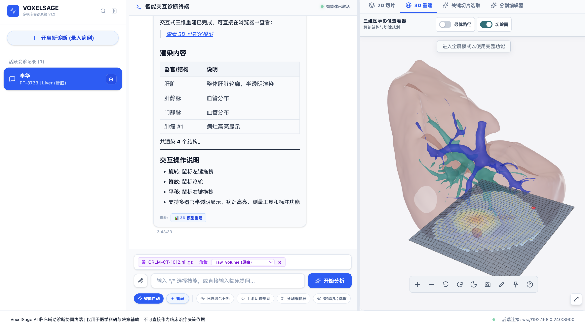
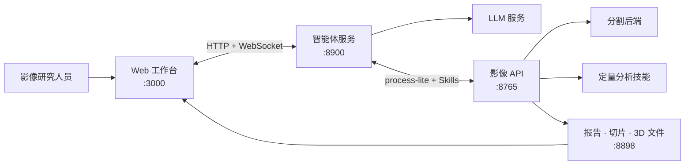

<div align="center">

[English](README.md) | **简体中文**


# VoxelSage

### 无需拼接分割、智能体与 3D 工具的 CT 分析工作台

面向腹部 CT 研究的自托管医学影像工作台。上传 DICOM 或 NIfTI 数据，使用
自然语言提问，在一个界面中完成分割、测量、关键切片选取与交互式 3D 复核。

[](https://github.com/ZJUMAI/VoxelSage)
[](https://github.com/ZJUMAI/VoxelSage/commits/main)
[](LICENSE)


[快速开始](#快速开始) · [核心能力](#核心能力) · [工作原理](#工作原理) · [Skills API](#skills-api--ai-智能体接入) · [项目文档](#项目文档)

</div>

<p align="center">
  <a href="docs/assets/web_overview.png">
    
  </a>
</p>

<p align="center"><em>同一病例、同一段对话，影像证据始终就在旁边。</em></p>

> [!CAUTION]
> VoxelSage 是实验性科研软件，并非医疗器械。请勿将其用于临床诊断、
> 治疗决策或任何其他临床用途。

## 快速开始

### 环境要求

- Python 3.10+
- Node.js 20+ 和 npm
- 兼容 OpenAI API 的 LLM 服务
- 满足所选分割后端要求的 CPU、内存和磁盘空间；部分后端还需要兼容的
  CUDA GPU

### 安装

```bash
git clone https://github.com/ZJUMAI/VoxelSage.git && cd VoxelSage
python -m venv .venv && source .venv/bin/activate
pip install -r Port_B/requirements.txt -r Port_A/requirements.txt
npm --prefix Frontend ci
cp Frontend/.env.example Frontend/.env.local
```

在用于启动 Port A 的同一终端中配置 LLM 服务：

```bash
export DASHSCOPE_API_KEY="your-api-key"
export DASHSCOPE_BASE_URL="https://your-llm-endpoint.example.com/v1"
```

### 启动

在仓库根目录打开四个终端：

<details open>
<summary><strong>1 · 影像 API</strong> — 在 <code>:8765</code> 提供分割与分析</summary>

```bash
cd Port_B
../.venv/bin/python API.py server --port 8765
```

</details>

<details open>
<summary><strong>2 · 输出代理</strong> — 在 <code>:8898</code> 提供生成文件</summary>

```bash
cd Port_B
../.venv/bin/python file_proxy.py --port 8898
```

</details>

<details open>
<summary><strong>3 · 智能体服务</strong> — 在 <code>:8900</code> 编排 LLM</summary>

```bash
cd Port_A
../.venv/bin/python -m core.server
```

</details>

<details open>
<summary><strong>4 · Web 前端</strong> — 在 <code>:3000</code> 提供研究工作台</summary>

```bash
npm --prefix Frontend run dev
```

</details>

启动完成后访问 **<http://localhost:3000>**。首次运行 TotalSegmentator 时可能
下载模型文件。VISTA3D 为可选后端，需要单独准备上游源码、配置和模型文件；
详见 [Port B 文档](Port_B/README.md#segmentation-backends)。

## 核心能力

- **让病例留在一个工作台中** — 上传 NIfTI 或 DICOM 数据，管理病例、浏览
  轴位切片并打开 3D 结果，无需来回切换应用。
- **用提问代替手工拼接流水线** — 智能体选择相关影像技能，并将进度与结果
  实时返回浏览器。
- **将分割掩膜转化为量化证据** — 通过复用技能测量肿瘤直径、肿瘤—血管
  距离、血管体积和肝脏相关指标。
- **在空间上下文中复核结果** — 将关键切片、分割叠加与交互式 Three.js
  重建关联到同一个分析会话。
- **避免重复执行高成本任务** — 复用病例结果、过滤冗余工具调用、校验测量值，
  并在发生错误后应用恢复策略。
- **扩展分析能力** — 通过统一、兼容函数调用的接口注册新的分析技能。
- **比较受约束的规划策略** — 默认使用确定性三维曲面基线，也可显式启用
  冻结学习排序器与模拟器安全盾，并在 `Research/planar-resection-planning`
  复现其二维实验依据。

## 工作原理



```text
DICOM / NIfTI → 分割 → 后处理 → 定量分析技能
               → 结构化结果 → 2D / 3D 复核 → 智能体回答
```

| 服务 | 职责 | 默认地址 |
| --- | --- | --- |
| **Frontend** | 病例管理、对话、2D 切片和 3D 结果展示 | `http://localhost:3000` |
| **Port A** | LLM 循环、工具选择、校验、恢复和流式输出 | `http://localhost:8900` |
| **Port B** | 分割、测量、结构化结果和影像技能 | `http://localhost:8765` |
| **输出代理** | 向浏览器提供生成的文件 | `http://localhost:8898` |

## Skills API & AI 智能体接入

Port B 将分析流程暴露为兼容函数调用的工具。外部智能体可以在运行时发现可用
技能，并仅对指定病例调用所需分析：

1. `POST /api/process-lite` — 准备、分割并后处理病例。
2. `GET /api/skills/list` — 以工具定义形式返回已注册技能。
3. `POST /api/skills/run` — 使用返回的 `case_id` 执行一个技能。

启动 Port B 后可查看实时工具目录：

```bash
curl http://localhost:8765/api/skills/list
```

内置技能包括肝脏综合分析、关键切片选取、3D 重建、肿瘤直径、肿瘤—血管
距离、血管体积和分割编辑。Port A 已为 Web 应用实现 LLM 与技能之间的迭代
调用循环。

## 配置说明

| 变量 | 服务 | 用途 | 默认值 |
| --- | --- | --- | --- |
| `DASHSCOPE_API_KEY` | Port A | LLM API 凭据 | 必填 |
| `DASHSCOPE_BASE_URL` | Port A | 兼容 OpenAI API 的基础地址 | 必填 |
| `PORT_B_INTERNAL` | Port A | Port B 内部访问地址 | `http://localhost:8765` |
| `PUBLIC_BASE_URL` | Port B | 输出代理的公开基础地址 | `http://127.0.0.1:8898` |
| `VOXELSAGE_OUTPUT_DIR` | Port B | 运行时输出目录 | `Port_B/output` |
| `VISTA3D_ROOT` | Port B | 可选的 VISTA3D 上游源码目录 | 未设置 |
| `VOXELSAGE_RESECTION_MODEL_CHECKPOINT` | Port B | 经授权的冻结 v10.6 规划权重 | 未设置 |

浏览器端服务地址见 [`Frontend/.env.example`](Frontend/.env.example)，可选影像
运行时配置见 [`Port_B/.env.example`](Port_B/.env.example)。

## 仓库结构

```text
VoxelSage/
├── Frontend/                    # React 19 + TypeScript + Vite 工作台
├── Port_A/                      # LLM 智能体与 WebSocket 编排
│   ├── core/                    # 智能体循环、校验和恢复机制
│   ├── docs/                    # 架构文档
│   └── tests/
├── Port_B/                      # 影像 API 与分析运行时
│   ├── SegAgent/                # 分割后端适配器
│   ├── Structural_Report/       # 结构化分析结果
│   ├── Tool_Box/                # 影像处理和测量工具
│   ├── Visualization/           # 切片与 Three.js 结果生成
│   ├── skills/                  # 内置及用户注册技能
│   └── tests/
├── LICENSE
├── NOTICE
└── THIRD_PARTY_NOTICES.md
```

## 验证

```bash
cd Port_B && ../.venv/bin/python -m pytest -q
cd ../Port_A && ../.venv/bin/python tests/test_p0_optimizations.py
cd ../Frontend && npm run lint && npm run build
```

## 项目文档

- [Port A 使用说明](Port_A/README.md) — 智能体配置与核心模块
- [Port A 架构](Port_A/docs/ARCHITECTURE.md) — 智能体循环、工具优化、反思机制
  和前端协议
- [Port B 使用说明](Port_B/README.md) — 影像服务、模型后端和数据处理
- [前端使用说明](Frontend/README.md) — UI 功能、配置和构建
- [学习排序器与安全盾三维 Skill](docs/LEARNED_RESECTION_SEQUENCE.md) — 实验模式配置、
  权重哈希、失败行为和范围限制
- [二维序贯规划研究](Research/planar-resection-planning/README.md) — 模拟器、训练、
  精确安全盾和确认结果
- [第三方声明](THIRD_PARTY_NOTICES.md) — 依赖与来源信息

## 贡献与支持

欢迎提交 Pull Request。提交前请运行[验证](#验证)中的检查，并确保提交内容不含
患者数据、凭据、模型权重或生成的医学影像产物。

- **问题反馈：** [GitHub Issues](https://github.com/ZJUMAI/VoxelSage/issues)
- **研究问题与功能建议：** Discussions 启用前暂时使用 GitHub Issues
- **私密安全报告：** [binghong.25@intl.zju.edu.cn](mailto:binghong.25@intl.zju.edu.cn)

## 负责任使用

- 仅处理已获得授权的数据；分享任何产物前，请移除 DICOM 标识符及其他受保护
  的健康信息。
- 患者数据、模型权重、生成结果和常见医学影像格式均有意排除在版本控制之外。
- 外部模型、数据集与依赖继续适用其原始许可。
- 所有分割、测量、报告和智能体回答均为实验结果，必须由具备资质的人员复核。

## 开源许可与致谢

VoxelSage 原创代码采用 [Apache License 2.0](LICENSE) 许可。外部软件、模型
权重和数据集不因本项目而重新授权；详情见 [`NOTICE`](NOTICE) 和
[`THIRD_PARTY_NOTICES.md`](THIRD_PARTY_NOTICES.md)。

Port B 的设计受到 3DMedAgent 项目及 Bézier 曲面肝切除规划相关公开工作的
启发。VoxelSage 与相关上游作者不存在隶属或背书关系。
